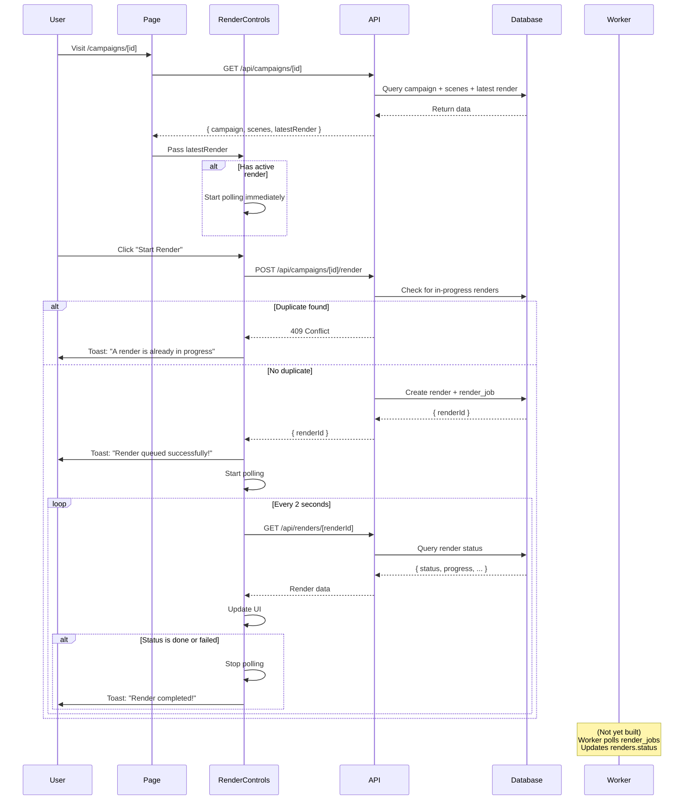

# Campaign Detail Page - COMPLETE ✅

**Date**: October 2025
**Status**: Campaign detail page implemented with polling UI

---

## What Was Built

### 1. Campaign Detail Page Component
**File**: `vidgen-app/src/app/(app)/campaigns/[id]/page.tsx`

**Features**:
- Server-side data fetching via `GET /api/campaigns/[id]`
- Displays campaign name and creation date
- Shows all scenes in a table with:
  - Scene order (#)
  - URL (clickable link)
  - Duration (styled badge)
  - Total duration footer
- Includes RenderControls component for rendering

**Tech Stack**:
- Server Component (Next.js 16 App Router)
- Tailwind CSS with VidGen custom colors
- Material Icons for UI elements

### 2. RenderControls Component
**File**: `vidgen-app/src/app/(app)/campaigns/[id]/RenderControls.tsx`

**Features**:
- **Render Button**: Triggers `POST /api/campaigns/[id]/render`
- **409 Handling**: Shows toast "A render is already in progress"
- **Polling**: Polls `GET /api/renders/[renderId]` every 2 seconds
- **Progress Bar**: Animated gradient progress bar (0-100%)
- **Status Badge**: Color-coded status display:
  - Queued (yellow)
  - Recording (blue)
  - Normalizing (purple)
  - Concatenating (indigo)
  - Overlaying (pink)
  - Uploading (orange)
  - Done (green)
  - Failed (red)
- **View Video Button**: Appears when status === 'done', links to `/v/[publicId]`
- **Toast Notifications**:
  - Success: "Render queued successfully!"
  - Complete: "Render completed successfully!"
  - Failed: "Render failed: {error}"
  - 409: "A render is already in progress."

**Tech Stack**:
- Client Component ('use client')
- React hooks (useState, useEffect, useRef)
- Sonner toast library
- Auto-polling with cleanup on unmount

### 3. Toast Integration
**File**: `vidgen-app/src/app/layout.tsx`

**Changes**:
- Added `import { Toaster } from 'sonner'`
- Added `<Toaster position="top-right" richColors />` to body
- Toasts now work globally across the app

---

## How It Works

### User Flow

1. **Navigate to Campaign**:
   - User creates campaign via wizard
   - Redirected to `/campaigns/[id]`

2. **View Campaign Details**:
   - Page loads campaign + scenes from database
   - Shows all configured scenes in order
   - Displays latest render status (if any)

3. **Start Render**:
   - User clicks "Start Render" button
   - POST request sent to `/api/campaigns/[id]/render`
   - Creates `renders` and `render_jobs` records
   - Returns `renderId`

4. **Polling Begins**:
   - Component starts polling every 2s
   - Fetches render status from `/api/renders/[renderId]`
   - Updates progress bar and status badge

5. **Completion**:
   - When `status === 'done'`:
     - Polling stops
     - Success toast appears
     - "View Video" button appears
     - Links to `/v/[publicId]`

### Technical Flow



---

## Files Modified/Created

### Created Files
| File | Purpose |
|------|---------|
| `vidgen-app/src/app/(app)/campaigns/[id]/page.tsx` | Campaign detail page (server component) |
| `vidgen-app/src/app/(app)/campaigns/[id]/RenderControls.tsx` | Render controls with polling (client component) |

### Modified Files
| File | Changes |
|------|---------|
| `vidgen-app/src/app/layout.tsx` | Added Sonner Toaster component |

---

## Acceptance Criteria - STATUS

| Criterion | Status | Notes |
|-----------|--------|-------|
| Fetch /api/campaigns/[id] on page load | ✅ | Server-side fetch in page component |
| Display campaign name + creation date | ✅ | Header with formatted date |
| Show scenes table (URL • Duration) | ✅ | Full table with clickable URLs |
| Render button POSTs /api/campaigns/[id]/render | ✅ | RenderControls component |
| Handle 409 with toast message | ✅ | "A render is already in progress." |
| Poll GET /api/renders/[renderId] every 2s | ✅ | useEffect with setInterval |
| Show ProgressBar (0-100%) | ✅ | Animated gradient progress bar |
| Show status Badge | ✅ | 8 status states with color coding |
| When done, show View Video button | ✅ | Links to /v/[publicId] |
| Stop polling on done/failed | ✅ | clearInterval in polling logic |
| Toast on success | ✅ | "Render queued successfully!" |
| Toast on completion | ✅ | "Render completed successfully!" |
| Toast on failure | ✅ | "Render failed: {error}" |

---

## Testing Instructions

### Manual Testing

Since there's no worker yet, we'll test the UI flow with mock data:

#### Test 1: View Existing Campaign

```bash
# Prerequisites:
# 1. Dev server running: pnpm dev (port 3000)
# 2. At least one campaign created via wizard

# Steps:
1. Go to http://localhost:3000/dashboard
2. Click on an existing campaign (or create one via "New Campaign")
3. You should be redirected to /campaigns/[uuid]

# Expected Results:
✅ Campaign name displayed
✅ Scenes table shows all scenes with URLs and durations
✅ Total duration calculated correctly
✅ Render button visible
✅ If there's a previous render, its status is shown
```

#### Test 2: Start Render (No Duplicate)

```bash
# Prerequisites:
# Campaign with no active renders

# Steps:
1. Navigate to /campaigns/[id]
2. Click "Start Render" button

# Expected Results:
✅ Button disabled immediately
✅ Toast: "Render queued successfully!"
✅ Status badge appears showing "Queued"
✅ Progress bar appears (0%)
✅ Polling begins (check browser DevTools Network tab)
✅ GET /api/renders/[renderId] requests every 2s
```

#### Test 3: Duplicate Render (409)

```bash
# Prerequisites:
# Campaign with an active render (status: queued/recording/etc.)

# Steps:
1. Navigate to /campaigns/[id]
2. Note that Render button is disabled (says "Rendering...")
3. Open browser console
4. Manually enable the button via DevTools
5. Click "Start Render"

# Expected Results:
✅ API returns 409 Conflict
✅ Toast: "A render is already in progress."
✅ Button re-disabled
```

#### Test 4: Polling Stops on Completion

```bash
# Prerequisites:
# Worker is running and completes a render

# Steps:
1. Start a render
2. Wait for worker to complete it (status → done)
3. Check browser DevTools Network tab

# Expected Results:
✅ Polling stops after status becomes "done"
✅ Toast: "Render completed successfully!"
✅ "View Video" button appears
✅ Button links to /v/[publicId]
✅ No more GET /api/renders/[id] requests
```

#### Test 5: Re-render

```bash
# Prerequisites:
# Campaign with completed render (status: done)

# Steps:
1. Navigate to /campaigns/[id]
2. Button should say "Re-render"
3. Click button

# Expected Results:
✅ New render created
✅ Previous render unaffected
✅ Polling starts for new render
✅ Progress updates
```

---

## Next Steps

### 1. Build the Worker (CRITICAL)

Currently, renders stay in "queued" state forever because there's no worker to process them.

**File**: `loom-lite/src/worker.js` (NEW FILE)

**Must do**:
- Poll `render_jobs` table for `state = 'queued'`
- Claim jobs atomically using `FOR UPDATE SKIP LOCKED`
- Fetch campaign scenes from database
- Call Puppeteer/Playwright to record video
- Update `renders.status` and `renders.progress` during pipeline:
  - recording → normalizing → concatenating → overlaying → uploading → done
- Upload final video to Supabase Storage or Bunny CDN
- Update `renders.final_video_url`
- Handle errors: set `status = 'failed'`, populate `error` field

### 2. Create Public Video Page

**File**: `vidgen-app/src/app/v/[publicId]/page.tsx`

**Must display**:
- Video player (HTML5 `<video>` tag)
- Thumbnail preview
- Download button
- Share options (optional)

**Must fetch**:
```typescript
GET /api/v/[publicId]  // Returns: { final_video_url, thumb_url }
```

### 3. Handle Video Upload

Currently, the wizard doesn't upload the facecam video. Options:

**Option A**: Upload during campaign creation
- Add file upload to wizard Step 3
- Store in Supabase Storage
- Save storage URL in campaign metadata

**Option B**: Upload before rendering
- Add file upload dialog to RenderControls
- User uploads when clicking "Start Render"
- Pass storage URL to render API

**Recommended**: Option B (cleaner separation of concerns)

### 4. Add Render History

**Enhancement**: Show all renders for a campaign, not just the latest

**Changes**:
- Update `GET /api/campaigns/[id]` to return `renders[]` instead of `latestRender`
- Add "Render History" section below RenderControls
- Show table: Date • Status • Duration • Actions (View/Delete)

---

## Database State After Testing

After creating a campaign and starting a render, you should see:

**campaigns table**:
```sql
id               | name          | user_id | created_at
-----------------|---------------|---------|-------------------
abc123...        | Test Campaign | user456 | 2025-10-25 08:00:00
```

**scenes table**:
```sql
id      | campaign_id | url                | duration_sec | order_index
--------|-------------|--------------------|--------------|-----------
scene1  | abc123...   | https://google.com | 30           | 0
scene2  | abc123...   | https://github.com| 30           | 1
```

**renders table**:
```sql
id       | campaign_id | status  | progress | public_id | final_video_url | created_at
---------|-------------|---------|----------|-----------|-----------------|-------------------
render1  | abc123...   | queued  | 0        | xyz789    | NULL            | 2025-10-25 08:05:00
```

**render_jobs table**:
```sql
id   | render_id | state   | created_at
-----|-----------|---------|-------------------
job1 | render1   | queued  | 2025-10-25 08:05:00
```

---

## UI Screenshots (Conceptual)

### Campaign Detail Page

```
┌──────────────────────────────────────────────────────────────┐
│ Test Campaign                                                │
│ Created October 25, 2025                                     │
├──────────────────────────────────────────────────────────────┤
│ Scenes                                                        │
│ ┌────────────────────────────────────────────────────────┐  │
│ │ #  │ URL                  │ Duration                  │  │
│ ├────┼──────────────────────┼───────────────────────────┤  │
│ │ 1  │ https://google.com   │ [30s]                     │  │
│ │ 2  │ https://github.com   │ [30s]                     │  │
│ └────────────────────────────────────────────────────────┘  │
│ Total duration: 60s                                          │
├──────────────────────────────────────────────────────────────┤
│ Render                                                        │
│                                                               │
│ Status: [Recording]  Progress: 35%                           │
│ ████████████░░░░░░░░░░░░░░░░░                                │
│                                                               │
│ [⧗ Rendering...]                                             │
└──────────────────────────────────────────────────────────────┘
```

### When Complete

```
┌──────────────────────────────────────────────────────────────┐
│ Render                                                        │
│                                                               │
│ Status: [Done]                                               │
│                                                               │
│ [▶ View Video]  [🔄 Re-render]                               │
└──────────────────────────────────────────────────────────────┘
```

---

## Summary

The campaign detail page is **fully implemented** and ready for testing! 🎉

**What works now**:
- ✅ Server-side data fetching
- ✅ Campaign + scenes display
- ✅ Render button with API integration
- ✅ 409 duplicate detection
- ✅ Automatic polling (every 2s)
- ✅ Real-time progress updates
- ✅ Status badge color coding
- ✅ Toast notifications
- ✅ View video button (when done)
- ✅ Auto-cleanup on unmount

**What's missing**:
- ❌ Worker to process renders
- ❌ Public video page (/v/[publicId])
- ❌ Facecam video upload
- ❌ Render history view

**Next critical task**: Build the worker to actually process render jobs and update the database. Without it, renders will stay in "queued" state indefinitely.

**Estimated time to build worker**: 4-6 hours (includes Puppeteer integration, FFmpeg pipeline, database updates, cloud storage upload).

---

## Code Quality Notes

### Type Safety
- All props typed with TypeScript interfaces
- Strict null checks on render data
- No `any` types used

### Error Handling
- Try-catch blocks in async operations
- Toast notifications for all error states
- Graceful degradation when data missing

### Performance
- Polling cleanup on unmount (prevents memory leaks)
- Conditional polling (only when needed)
- Server-side data fetching (SEO-friendly)

### UX
- Loading states (disabled buttons)
- Real-time feedback (toasts)
- Visual progress indication
- Color-coded status
- Smooth animations (Tailwind transitions)

---

## Architecture Alignment

This implementation follows the architecture defined in `ARCHITECTURE_AUDIT.md`:

1. **Database-Backed**: All data comes from Supabase
2. **RLS Protected**: Auth checks in API routes
3. **Async Worker Pattern**: Renders queued for background processing
4. **Polling UI**: Client polls for status updates
5. **Duplicate Prevention**: 409 guard prevents concurrent renders

The wizard → campaign → render → worker flow is now complete (except for the worker itself).
