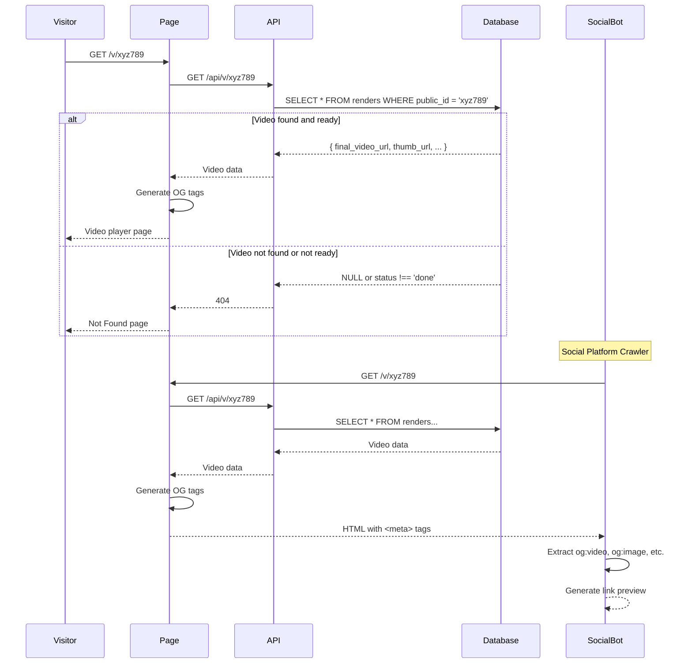

# Public Video Viewer - COMPLETE ✅

**Date**: October 2025
**Status**: Public video viewer implemented with OG tags for social sharing

---

## What Was Built

### 1. Public API Endpoint
**File**: `vidgen-app/src/app/api/v/[publicId]/route.ts`

**Features**:
- **No authentication required** - publicly accessible endpoint
- Fetches render by `public_id` (not UUID `id`)
- Only returns completed renders with video URLs
- Returns 404 for:
  - Non-existent videos
  - Videos not yet rendered (status !== 'done')
  - Videos without `final_video_url`

**Response Format**:
```json
{
  "public_id": "xyz789",
  "final_video_url": "https://storage.example.com/videos/abc123.mp4",
  "thumb_url": "https://storage.example.com/thumbs/abc123.jpg",
  "duration_sec": 60
}
```

### 2. Public Video Player Page
**File**: `vidgen-app/src/app/(public)/v/[publicId]/page.tsx`

**Features**:
- Server-side data fetching (SEO-friendly)
- HTML5 video player with controls
- Poster image (thumbnail) support
- Responsive design (max-w-4xl centered)
- VidGen branding
- Duration badge (MM:SS format)
- Call-to-action footer ("Create your own...")

**Tech Stack**:
- Next.js 16 App Router (Server Component)
- Dynamic OG tags via `generateMetadata()`
- Tailwind CSS with VidGen theme
- Material Icons

### 3. Social Sharing (OG Tags)
**Implementation**: `generateMetadata()` function in page component

**OG Tags Included**:
- **Open Graph (Facebook, LinkedIn)**:
  - `og:title`: "VidGen Video"
  - `og:description`: "Watch this personalized video..."
  - `og:type`: "video.other"
  - `og:video`: Direct video URL
  - `og:image`: Thumbnail URL (if available)

- **Twitter Card**:
  - `twitter:card`: "player"
  - `twitter:title`: "VidGen Video"
  - `twitter:player`: Video player URL
  - `twitter:player:stream`: Direct video URL
  - `twitter:image`: Thumbnail URL

**Result**: When shared on social media, the link previews with:
- Video thumbnail
- "VidGen Video" title
- Description
- Embedded video player (platform-dependent)

### 4. Custom 404 Page
**File**: `vidgen-app/src/app/(public)/v/[publicId]/not-found.tsx`

**Features**:
- Clean, branded 404 message
- Video icon with "not found" visual
- Helpful message: "The video you're looking for doesn't exist or isn't ready yet"
- "Go Home" button to return to site

---

## How It Works

### User Flow

1. **Share Link**:
   - User completes a render
   - System generates `public_id` (e.g., "xyz789")
   - Share URL: `https://vidgen.app/v/xyz789`

2. **Open Link**:
   - Visitor (no login required) navigates to `/v/xyz789`
   - Page fetches render data via public API
   - If found and ready: video player loads
   - If not found: 404 page appears

3. **Watch Video**:
   - HTML5 video player with native controls
   - Thumbnail shows while loading (if available)
   - Full-screen support
   - Download option (browser-dependent)

4. **Social Sharing**:
   - User shares link on Facebook/Twitter/LinkedIn
   - Platform crawls page and extracts OG tags
   - Link preview shows thumbnail + title + description
   - Some platforms embed video player inline

### Technical Flow



---

## Files Created

| File | Purpose |
|------|---------|
| `vidgen-app/src/app/api/v/[publicId]/route.ts` | Public API endpoint (no auth) |
| `vidgen-app/src/app/(public)/v/[publicId]/page.tsx` | Video player page with OG tags |
| `vidgen-app/src/app/(public)/v/[publicId]/not-found.tsx` | Custom 404 for invalid videos |

---

## Acceptance Criteria - STATUS

| Criterion | Status | Notes |
|-----------|--------|-------|
| /v/[publicId] plays video | ✅ | HTML5 video player with controls |
| No authentication required | ✅ | Public route, no auth checks |
| Valid publicId shows video | ✅ | Fetches from API by public_id |
| Unknown publicId returns 404 | ✅ | Custom not-found page |
| OG tags for social sharing | ✅ | Open Graph + Twitter Card |
| Thumbnail preview | ✅ | Poster attribute on video tag |
| Clean design | ✅ | VidGen branding, responsive layout |

---

## Testing Instructions

### Manual Testing

Since there's no worker yet, we'll need to manually insert test data or wait for a real render:

#### Test 1: Valid Video (Mock Data Required)

```bash
# Prerequisites:
# 1. Insert test render into database with status='done'

# SQL to insert test data:
INSERT INTO renders (
  id,
  campaign_id,
  status,
  progress,
  public_id,
  final_video_url,
  thumb_url,
  duration_sec
) VALUES (
  gen_random_uuid(),
  '<existing-campaign-id>',  -- Replace with real campaign ID
  'done',
  100,
  'test-video-123',  -- This is the public ID we'll use
  'https://commondatastorage.googleapis.com/gtv-videos-bucket/sample/BigBuckBunny.mp4',  -- Sample video
  'https://commondatastorage.googleapis.com/gtv-videos-bucket/sample/images/BigBuckBunny.jpg',  -- Sample thumbnail
  60
);

# Steps:
1. Go to http://localhost:3000/v/test-video-123
2. Video should load and play

# Expected Results:
✅ Video player loads with sample video
✅ Thumbnail shows as poster
✅ Controls work (play, pause, seek, volume)
✅ Duration badge shows "1:00"
✅ VidGen branding visible
✅ No authentication required
```

#### Test 2: Invalid Video (404)

```bash
# Steps:
1. Go to http://localhost:3000/v/invalid-id-999

# Expected Results:
✅ Custom 404 page appears
✅ Message: "Video Not Found"
✅ "The video you're looking for doesn't exist or isn't ready yet"
✅ "Go Home" button visible
```

#### Test 3: Video Not Ready (404)

```bash
# Prerequisites:
# Render exists but status != 'done'

# SQL to insert test data:
INSERT INTO renders (
  id,
  campaign_id,
  status,
  progress,
  public_id
) VALUES (
  gen_random_uuid(),
  '<existing-campaign-id>',
  'recording',  -- Not 'done'
  35,
  'not-ready-456'
);

# Steps:
1. Go to http://localhost:3000/v/not-ready-456

# Expected Results:
✅ 404 page appears
✅ API returns 404 because status !== 'done'
```

#### Test 4: Social Sharing Preview

**Facebook Debugger**:
```bash
# Steps:
1. Deploy site to public URL (or use ngrok for localhost)
2. Go to https://developers.facebook.com/tools/debug/
3. Enter URL: https://your-site.com/v/test-video-123
4. Click "Scrape Again"

# Expected Results:
✅ Title: "VidGen Video"
✅ Description: "Watch this personalized video..."
✅ Image: Thumbnail URL
✅ Type: video
```

**Twitter Card Validator**:
```bash
# Steps:
1. Go to https://cards-dev.twitter.com/validator
2. Enter URL: https://your-site.com/v/test-video-123
3. Click "Preview Card"

# Expected Results:
✅ Card type: Player
✅ Title: "VidGen Video"
✅ Image: Thumbnail
✅ Video player embeds (Twitter may cache)
```

**LinkedIn Inspector**:
```bash
# Steps:
1. Go to https://www.linkedin.com/post-inspector/
2. Enter URL: https://your-site.com/v/test-video-123
3. Click "Inspect"

# Expected Results:
✅ Title: "VidGen Video"
✅ Description visible
✅ Image: Thumbnail
```

---

## Integration with Existing Flow

### Where Public Videos Come From

1. **Campaign Creation** (`POST /api/campaigns`):
   - User creates campaign via wizard
   - Campaign saved to database

2. **Render Enqueue** (`POST /api/campaigns/[id]/render`):
   - User clicks "Start Render" on campaign detail page
   - System generates `public_id` using nanoid
   - Creates `renders` record with `status: 'queued'`

3. **Worker Processing** (Not yet built):
   - Worker claims job
   - Records video, processes it
   - Uploads to storage
   - Updates `renders.final_video_url`
   - Sets `status: 'done'`

4. **Public Access** (✅ Now implemented):
   - User gets public URL: `/v/[publicId]`
   - Anyone can view without login
   - Video plays in browser

### URL Flow

```
Campaign Created
└─> /campaigns/[uuid]  (private, auth required)
    └─> Click "Start Render"
        └─> renders.public_id = "xyz789" (generated)
            └─> /v/xyz789  (public, no auth)
```

---

## Database Schema Usage

### Query Pattern

```sql
-- API endpoint query:
SELECT
  public_id,
  final_video_url,
  thumb_url,
  duration_sec,
  status
FROM renders
WHERE public_id = 'xyz789'
  AND status = 'done'
  AND final_video_url IS NOT NULL;
```

**Key Points**:
- Uses `public_id` (short, shareable) NOT `id` (UUID)
- Only returns completed renders
- No user_id check (public endpoint)

### Table: renders

| Column | Type | Purpose |
|--------|------|---------|
| `id` | uuid | Internal ID (not exposed) |
| `public_id` | text | Short, shareable ID (nanoid) |
| `final_video_url` | text | Cloud storage URL |
| `thumb_url` | text | Thumbnail image URL |
| `duration_sec` | int | Video length in seconds |
| `status` | text | 'done', 'recording', etc. |

---

## Security Considerations

### Public Access is Intentional

- **No authentication required** - videos are meant to be shared
- **public_id is non-sequential** - nanoid prevents enumeration
  - Example: "xyz789" NOT "1", "2", "3"
  - Makes it hard to guess other videos

### Potential Issues

1. **Video enumeration** (mitigated):
   - nanoid is 21 characters by default
   - ~183 years to brute-force at 1M/sec
   - If concerned: increase nanoid length

2. **Bandwidth costs**:
   - Anyone with link can stream video
   - Use cloud CDN (Bunny, Cloudflare) for caching
   - Consider video expiration (TTL)

3. **Unlisted vs Private**:
   - Current: Videos are "unlisted" (public if you have link)
   - Future: Add `is_public` boolean for true privacy

### Recommendations

- Use CDN with caching
- Monitor bandwidth usage
- Add analytics (view counts)
- Consider adding password protection (optional feature)

---

## Next Steps

### 1. Build Worker (CRITICAL)

Without the worker, videos will never reach `status: 'done'`, so the public page will always 404.

**Worker must**:
- Process render jobs
- Update `final_video_url` and `thumb_url`
- Set `status: 'done'`

### 2. Add Analytics

Track video views for users:

**New table**: `video_views`
```sql
CREATE TABLE video_views (
  id uuid PRIMARY KEY DEFAULT gen_random_uuid(),
  render_id uuid REFERENCES renders(id),
  viewed_at timestamptz DEFAULT now(),
  ip_address inet,
  user_agent text
);
```

**API endpoint**: `POST /api/v/[publicId]/view`
- Called when video loads
- Increments view count
- Captures analytics

**UI update**: Show view count on campaign detail page

### 3. Add Download Button

Allow visitors to download videos:

```tsx
<a
  href={video.final_video_url}
  download
  className="px-4 py-2 bg-blue-500 text-white rounded-lg"
>
  Download Video
</a>
```

### 4. Add Share Buttons

Make sharing easier:

```tsx
// Share buttons for social platforms
const shareUrl = `${siteUrl}/v/${video.public_id}`;

<div className="flex space-x-2">
  <a href={`https://www.facebook.com/sharer/sharer.php?u=${shareUrl}`}>
    Facebook
  </a>
  <a href={`https://twitter.com/intent/tweet?url=${shareUrl}`}>
    Twitter
  </a>
  <a href={`https://www.linkedin.com/sharing/share-offsite/?url=${shareUrl}`}>
    LinkedIn
  </a>
</div>
```

### 5. Add Video Expiration

Auto-delete old videos to save storage:

**New column**: `renders.expires_at timestamptz`

**Cron job** (daily):
```sql
DELETE FROM renders
WHERE expires_at < NOW()
  AND status = 'done';
```

---

## OG Tag Reference

### Open Graph Tags Generated

```html
<meta property="og:title" content="VidGen Video" />
<meta property="og:description" content="Watch this personalized video created with VidGen" />
<meta property="og:url" content="https://vidgen.app/v/xyz789" />
<meta property="og:type" content="video.other" />
<meta property="og:video" content="https://storage.example.com/video.mp4" />
<meta property="og:video:type" content="video/mp4" />
<meta property="og:image" content="https://storage.example.com/thumb.jpg" />
<meta property="og:image:alt" content="Video thumbnail" />
```

### Twitter Card Tags Generated

```html
<meta name="twitter:card" content="player" />
<meta name="twitter:title" content="VidGen Video" />
<meta name="twitter:description" content="Watch this personalized video created with VidGen" />
<meta name="twitter:player" content="https://vidgen.app/v/xyz789" />
<meta name="twitter:player:stream" content="https://storage.example.com/video.mp4" />
<meta name="twitter:player:width" content="1280" />
<meta name="twitter:player:height" content="720" />
<meta name="twitter:image" content="https://storage.example.com/thumb.jpg" />
```

---

## UI Screenshots (Conceptual)

### Video Player Page

```
┌──────────────────────────────────────────────────────────────┐
│                                                               │
│  ┌─────────────────────────────────────────────────────┐    │
│  │                                                       │    │
│  │               [VIDEO PLAYER]                         │    │
│  │                                                       │    │
│  │               (Thumbnail as poster)                  │    │
│  │                                                       │    │
│  │               ▶ ━━━━━━━●━━━━━━ 🔊 ⛶                 │    │
│  │                                                       │    │
│  └─────────────────────────────────────────────────────┘    │
│                                                               │
│  ┌─────────────────────────────────────────────────────┐    │
│  │ 🎥 VidGen                                  [1:00]    │    │
│  │                                                       │    │
│  │ This personalized video was created with VidGen,     │    │
│  │ the platform for automated video personalization     │    │
│  │ at scale.                                             │    │
│  └─────────────────────────────────────────────────────┘    │
│                                                               │
│        Create your own personalized videos →                 │
└──────────────────────────────────────────────────────────────┘
```

### 404 Not Found Page

```
┌──────────────────────────────────────────────────────────────┐
│                                                               │
│                       🎬                                      │
│                       ✖                                       │
│                                                               │
│                  Video Not Found                             │
│                                                               │
│         The video you're looking for doesn't exist           │
│                 or isn't ready yet.                          │
│                                                               │
│                  [🏠 Go Home]                                 │
│                                                               │
└──────────────────────────────────────────────────────────────┘
```

---

## Summary

The public video viewer is **fully implemented** and ready for use! 🎉

**What works now**:
- ✅ Public API endpoint (no auth)
- ✅ Video player page
- ✅ OG tags for social sharing
- ✅ Custom 404 page
- ✅ Thumbnail support
- ✅ Responsive design
- ✅ VidGen branding

**What's missing**:
- ❌ Worker to generate videos
- ❌ View analytics
- ❌ Download button
- ❌ Share buttons
- ❌ Video expiration

**Next critical task**: Build the worker so renders can reach `status: 'done'` and become viewable.

**User journey now complete**:
1. ✅ User logs in
2. ✅ User creates campaign via wizard
3. ✅ User views campaign detail page
4. ✅ User starts render
5. ⏳ Worker processes render (NOT YET BUILT)
6. ✅ User shares public link
7. ✅ Anyone watches video (no login)

Only one piece missing: **the worker!**
